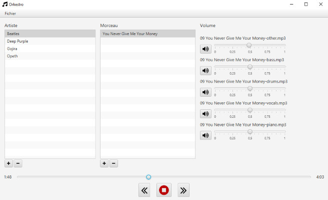

# Orkestro

Orkestro is a utility program for playing multiple audio files in parallel while managing the sound volume of each one.
Its aim is to provide a simple software solution for musicians with separate audio tracks to better break down and analyse music for educational purposes.

Orkestro is open source because it is distributed under the [GNU GPL v3 license](https://www.gnu.org/licenses/gpl-3.0.en.html).

## Get Started
1. Get the latest release

    There are two ways to use Orkestro. You can run it directly with you Java installation, or if you just want to double-click, you can use the windows build.
   * Java
     * Download **orkestro-1.1-shaded.jar** on the [Releases](https://github.com/louis-dg/orkestro/releases) page
     * Run it with Java (version >= 17) 
       * [Java download page](https://www.oracle.com/fr/java/technologies/downloads/#jdk19-windows) 
   * Windows
      * Download **Orkestro-1.1-win-x64.zip** on the [Releases](https://github.com/louis-dg/orkestro/releases) page
      * Unzip it where you want 
      * Double-click on **orkestro.bat**
2. Use Orkestro
   * Select a main folder containing the audio files, by clicking on Files/Main folder. It must contain folders that contain audio files. See following pattern:
        ```
        <Main folder>
            <Artist1 folder>
                <Track1 folder>
                    <audio file 1>
                    <audio file 2>
                    <audio file 3>
                <Track2 folder>
                    <audio file 1>
                    ...
            <Artist2 folder >
            ...
        ```
     **/!\ Audio files must have the same duration.**
   * Play !

   

## Languages
Currently, the available languages are French and English.

## Build
Orkestro is currently build with maven. It is developed with OpenJDK 17.
See [pom.xml](pom.xml) for more details.
You can download OpenJDK [here](https://jdk.java.net/18/).